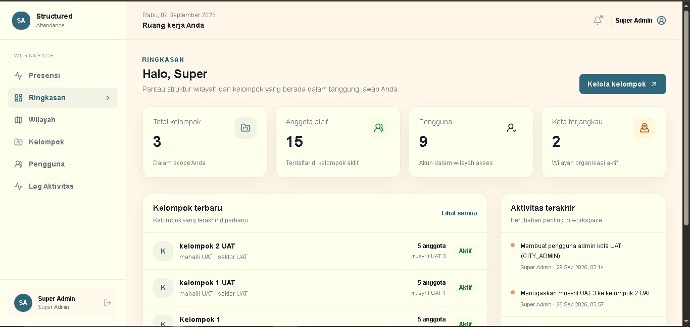
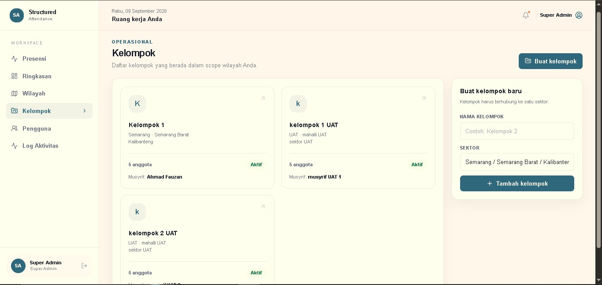
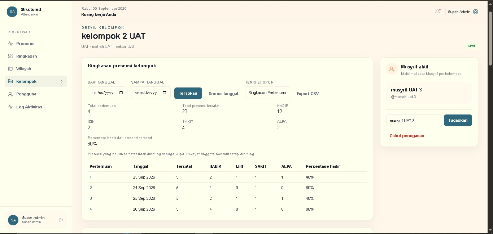
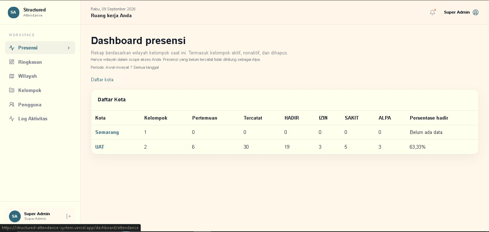

# Structured Attendance


Structured Attendance adalah sistem manajemen kehadiran berbasis hierarki untuk organisasi yang memiliki struktur wilayah dan kelompok binaan.

Struktur organisasi:

```
Kota → Mahalli → Sektor → Kelompok
```

Aplikasi membantu mengelola kelompok, penugasan Musyrif, pertemuan, presensi anggota, laporan, dan histori organisasi secara terpusat.

Antarmuka menggunakan Bahasa Indonesia. Hak akses pengguna dikontrol berdasarkan peran, cakupan wilayah, dan penugasan aktif.

---

# Overview

Structured Attendance dibuat untuk membantu organisasi yang memiliki struktur pengelolaan bertingkat dalam mengelola aktivitas kelompok secara lebih terstruktur.

Sistem membantu administrator mengelola:

- wilayah organisasi
- akun pengguna berdasarkan peran
- kelompok binaan
- penugasan Musyrif
- pencatatan pertemuan
- presensi anggota
- laporan dan ekspor data

Aplikasi dirancang untuk menjaga histori organisasi tetap konsisten meskipun terjadi:

- perubahan penugasan Musyrif
- pergantian pengelola
- perubahan struktur organisasi

Data historis tidak hilang ketika terjadi perubahan pengelolaan.

---

# Screenshot

## Dashboard



## Manajemen Kelompok



## Detail Kelompok



## Pencatatan Presensi



---

# Demo

Production Demo:

https://structured-attendance-system.vercel.app

Demo account:

```
Hubungi administrator untuk mendapatkan akses.
```

---

# Dokumentasi

| Pengguna | Dokumentasi |
| --- | --- |
| Client, administrator, dan Musyrif | [Panduan pengguna](docs/client-guide.md) |
| Engineer deployment | [Panduan deployment](docs/deployment-guide.md) |
| Developer / administrator hosting | [Referensi environment](docs/environment-reference.md) |
| Operator teknis | [Panduan operasional](docs/operations-guide.md) |

Dokumentasi engineering tambahan:

- [Deployment security dan proxy configuration](docs/deployment.md)
- [Production security controls](docs/production-security.md)
- [Supabase backup dan restore](docs/backup-restore.md)
- [Dependency advisory triage](docs/dependency-security.md)
- [Integration testing PostgreSQL](docs/integration-tests.md)

---

# Fitur Utama

## Manajemen Struktur Organisasi

Mengelola organisasi berbasis hierarki:

```
Kota
 └── Mahalli
      └── Sektor
           └── Kelompok
```

Setiap pengguna hanya dapat mengakses data sesuai:

- role pengguna
- wilayah yang dikelola
- assignment aktif

---

## Manajemen Kelompok dan Anggota

Administrator dapat:

- membuat kelompok
- mengelola anggota
- melihat detail kelompok
- mempertahankan histori anggota

Anggota yang sudah tidak aktif tetap dipertahankan untuk kebutuhan histori.

---

## Manajemen Musyrif

Sistem mendukung:

- penugasan Musyrif
- perubahan penanggung jawab kelompok
- histori penugasan sebelumnya

Pergantian Musyrif tidak menghapus histori pengelolaan sebelumnya.

---

## Presensi Pertemuan

Sistem mencatat:

- pertemuan kelompok
- materi atau ringkasan kegiatan
- daftar kehadiran anggota

Status presensi:

- Hadir
- Izin
- Sakit
- Alpa

Data yang belum dicatat tidak otomatis dianggap sebagai Alpa.

---

## Laporan dan Ekspor Data

Menyediakan:

- laporan presensi
- histori pertemuan
- histori anggota
- ekspor CSV

---

## Activity Log

SUPER_ADMIN dapat melihat aktivitas penting dalam sistem untuk membantu monitoring dan audit.

---

# Fitur Yang Belum Tersedia

Saat ini aplikasi belum memiliki:

- aplikasi mobile native
- notifikasi otomatis
- pemulihan password mandiri melalui email

---

# Architecture Overview

Gambaran arsitektur aplikasi:

```
User
 |
 v
Next.js Application
 |
 v
Prisma ORM
 |
 v
PostgreSQL (Supabase)
```

Service tambahan:

```
Vercel
 └── Application Hosting

Supabase
 └── PostgreSQL Database

Upstash Redis
 └── Login Rate Limiting
```

---

# Technology Stack

## Application

- Next.js App Router
- React
- TypeScript
- Tailwind CSS
- Custom Authentication
- Prisma ORM

## Database

- PostgreSQL

Database production menggunakan Supabase.

Supabase Auth tidak digunakan karena aplikasi menggunakan custom authentication.

## Infrastructure

- Vercel deployment
- PostgreSQL / Supabase
- Upstash Redis

---

# Security & Access Control

Sistem menggunakan:

- username/password authentication
- HTTP-only session
- role based access control
- hierarchical permission scope
- login rate limiting

Hak akses ditentukan berdasarkan:

- role pengguna
- wilayah yang dikelola
- assignment aktif

---

# Data Integrity

Structured Attendance dirancang untuk menjaga konsistensi histori organisasi.

Contoh:

Jika seorang Musyrif diganti, data pertemuan dan presensi sebelumnya tetap terhubung dengan histori yang benar.

Perubahan struktur organisasi tidak menghapus histori aktivitas sebelumnya.

---

# Developer Quick Start

Gunakan:

- Node.js 24 LTS atau Node.js 22 LTS
- npm
- PostgreSQL development database

Salin konfigurasi:

```bash
cp .env.example .env
```

Isi environment sesuai dokumentasi.

Contoh:

```env
APP_ORIGIN=http://localhost:5000

SEED_DEMO_DATA=false
```

Install dependency:

```bash
npm ci
```

Generate Prisma client:

```bash
npm run db:generate
```

Jalankan migration:

```bash
npx prisma migrate deploy
```

Seed database:

```bash
npx prisma db seed
```

Jalankan development server:

```bash
npm run dev
```

---

# Developer Commands

| Command | Fungsi |
| --- | --- |
| `npm run dev` | Development server |
| `npm test` | Menjalankan test suite |
| `npx tsc --noEmit` | Type checking |
| `npm run lint` | ESLint check |
| `npm run build` | Production build |
| `npm start` | Production server |
| `npx prisma migrate deploy` | Menjalankan migration |

Untuk database production jangan gunakan:

```bash
npx prisma migrate dev
npx prisma migrate reset
npx prisma db push
```

Gunakan migration yang terkontrol melalui proses deployment.

---

# Technical Structure

| Location | Responsibility |
| --- | --- |
| `src/app/dashboard/` | Dashboard dan halaman utama |
| `src/app/api/` | Authentication, mutation, export |
| `src/components/` | UI components |
| `src/lib/` | Authentication, authorization, validators |
| `prisma/` | Database schema dan migration |
| `tests/` | Testing |
| `scripts/` | Utility scripts |

---

# Release Status

Version:

```
v1.0.0
```

Status:

✅ Production deployment tested on Vercel  
✅ Authentication workflow tested  
✅ Role and permission system tested  
✅ Attendance workflow tested  
✅ CSV export tested  
✅ Production handover documentation completed  

Deployment platform lain seperti Cloud Run atau generic Node hosting membutuhkan konfigurasi dan pengujian tambahan.

Dokumentasi berikut tersedia:

- deployment guide
- environment configuration
- operational guide
- backup and recovery procedure

---

# License

Private / Internal Project.

Source code tersedia untuk kebutuhan portfolio, review teknis, dan pengembangan internal.